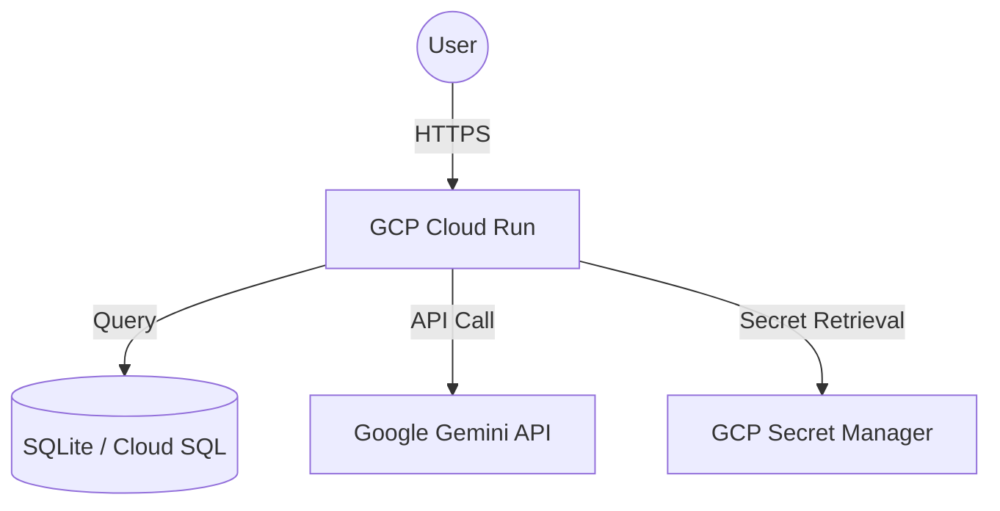

# GCP Deployment Architecture & Secret Management

This document outlines the architecture for deploying the BRStock AI platform to Google Cloud Platform (GCP) and how sensitive information like API keys is managed.

## 1. High-Level Architecture

The application is containerized using Docker and deployed to **Google Cloud Run**, a serverless container platform that handles scaling and infrastructure management.



## 2. Secret Management Strategy

To ensure security and prevent accidental exposure of API keys (like `GEMINI_API_KEY`), we use a tiered approach:

### Local Development
- **File**: `services/backend_api/.env`
- **Mechanism**: The backend uses the `python-dotenv` library to load variables from this file into the environment.
- **Security**: The `.env` file is explicitly listed in `.gitignore` to prevent it from being committed to version control.

### GCP Production (Cloud Run)
On GCP, we do **not** use `.env` files. Instead, we use native cloud mechanisms:

1.  **Environment Variables**: During deployment via `gcloud` or GCP Console, we set the `GEMINI_API_KEY` as an environment variable for the Cloud Run service.
2.  **Secret Manager (Recommended)**: For maximum security:
    - Store the key in **GCP Secret Manager**.
    - Grant the Cloud Run service account permission to access the secret.
    - Map the secret to an environment variable or volume mount within Cloud Run.

## 3. Deployment Flow

1.  **Containerization**: `Dockerfile` packages the FastAPI backend and static frontend.
2.  **Artifact Registry**: The Docker image is pushed to GCP Artifact Registry.
3.  **Cloud Run Deployment**:
    ```bash
    gcloud run deploy brstock-app \
      --image gcr.io/[PROJECT_ID]/brstock-app \
      --set-env-vars="GEMINI_API_KEY=[YOUR_KEY_HERE]" \
      --platform managed
    ```

## 4. Key Security Rules
- **NEVER** hardcode keys in Python files.
- **NEVER** push `.env` files to GitHub.
- **ALWAYS** rotate keys if you suspect they have been compromised.
