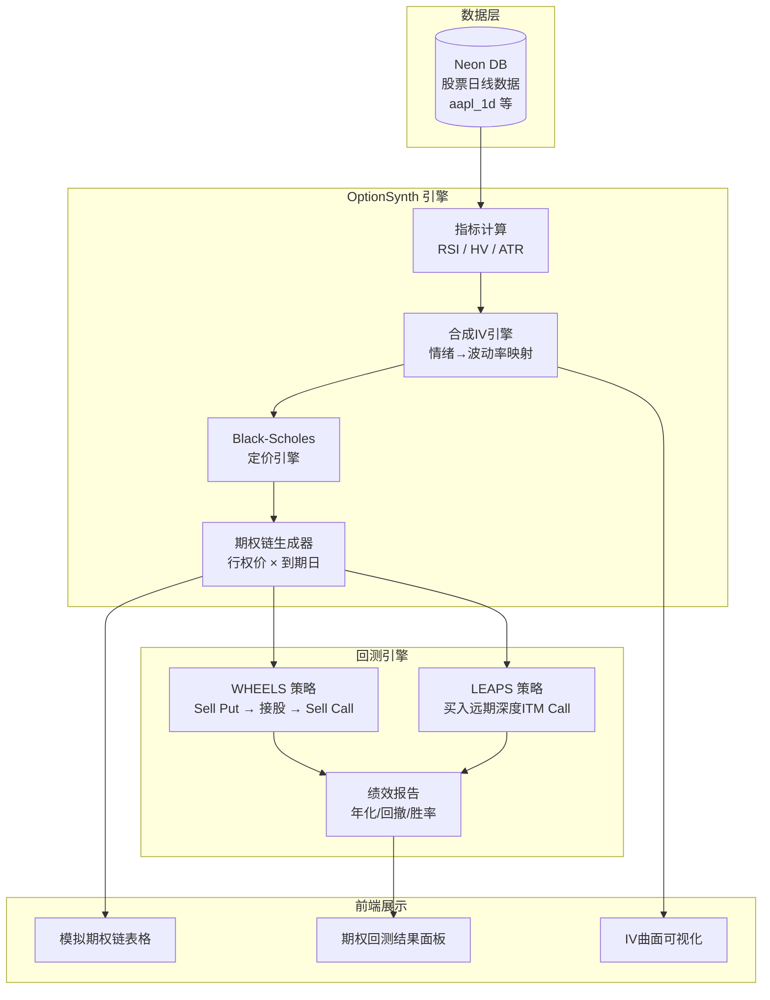

# OptionSynth — 模拟期权链生成器 & 期权策略回测引擎

> **项目**: BRstock1 扩展模块  
> **版本**: v1.0 Draft  
> **日期**: 2026-05-09  
> **数据粒度**: 日级（Daily）

---

## 1. 背景与动机

当前 BRstock1 平台通过 Moomoo OpenD 获取实时期权链数据，但存在以下痛点：

| 问题 | 影响 |
|------|------|
| Moomoo OpenD 需要 SMS 验证，连接不稳定 | 无法持续获取数据 |
| 历史期权链数据极难获取且昂贵 | 无法进行期权策略回测 |
| LEAPS / WHEELS 策略需要长期数据验证 | 无法评估策略年化收益 |

**解决方案**: 构建 `OptionSynth` 模块 — 基于历史股价 + 技术指标，使用 Black-Scholes 定价模型**合成模拟期权链**，用于期权策略回测和前端展示。

---

## 2. 系统架构总览



---

## 3. 核心模块设计

### 3.1 合成隐含波动率 (Synthetic IV) 引擎

> **核心思想**: 真实 IV 反映市场情绪。我们用 RSI + 历史波动率(HV) + 可选的 VIX 数据来近似。

**IV 估算公式**:

```
Synthetic_IV = HV_20d × Sentiment_Multiplier × Skew_Factor
```

| 参数 | 计算方法 | 说明 |
|------|---------|------|
| `HV_20d` | 过去20日收盘价对数收益率的标准差 × √252 | 年化历史波动率 |
| `Sentiment_Multiplier` | 基于 RSI 的情绪系数 | 见下表 |
| `Skew_Factor` | 基于行权价距现价的偏移 | 模拟波动率微笑 |

**情绪映射表 (RSI → Sentiment Multiplier)**:

| RSI 区间 | 市场状态 | Multiplier | 理由 |
|----------|---------|-----------|------|
| RSI < 20 | 极度恐慌 | 1.8 | 暴跌时 IV 飙升 (如 VIX 冲高) |
| 20 ≤ RSI < 30 | 恐慌 | 1.5 | 超卖区，Put 需求激增 |
| 30 ≤ RSI < 45 | 偏空 | 1.2 | 轻微恐慌溢价 |
| 45 ≤ RSI < 55 | 中性 | 1.0 | 基准 |
| 55 ≤ RSI < 70 | 偏多 | 0.9 | 市场平稳，IV 收缩 |
| RSI ≥ 70 | 过热 | 1.1 | 超买区可能反转，IV 小幅抬升 |

**波动率微笑 (Skew Factor)**:

```python
moneyness = strike / spot_price
if moneyness < 0.95:    # Deep OTM Put
    skew = 1.0 + 0.3 * (0.95 - moneyness)   # OTM Put IV偏高
elif moneyness > 1.05:  # Deep OTM Call
    skew = 1.0 + 0.1 * (moneyness - 1.05)   # OTM Call IV略高
else:
    skew = 1.0           # ATM 区间
```

### 3.2 Black-Scholes 定价引擎

标准欧式期权定价。对于美式期权（美股标准），我们使用 B-S 作为基础并加入提前行权估值。

```python
from scipy.stats import norm
import numpy as np

def black_scholes(S, K, T, r, sigma, q=0, option_type='call'):
    """
    S: 现价, K: 行权价, T: 距到期年数
    r: 无风险利率, sigma: IV, q: 股息率
    """
    if T <= 0:
        # 到期日: 计算内在价值
        if option_type == 'call':
            return max(S - K, 0)
        return max(K - S, 0)

    d1 = (np.log(S/K) + (r - q + 0.5*sigma**2)*T) / (sigma*np.sqrt(T))
    d2 = d1 - sigma*np.sqrt(T)

    if option_type == 'call':
        price = S*np.exp(-q*T)*norm.cdf(d1) - K*np.exp(-r*T)*norm.cdf(d2)
    else:
        price = K*np.exp(-r*T)*norm.cdf(-d2) - S*np.exp(-q*T)*norm.cdf(-d1)

    return max(price, 0)

def calc_greeks(S, K, T, r, sigma, q=0, option_type='call'):
    """计算 Greeks: Delta, Gamma, Theta, Vega"""
    d1 = (np.log(S/K) + (r - q + 0.5*sigma**2)*T) / (sigma*np.sqrt(T))
    d2 = d1 - sigma*np.sqrt(T)

    gamma = np.exp(-q*T) * norm.pdf(d1) / (S * sigma * np.sqrt(T))
    vega = S * np.exp(-q*T) * norm.pdf(d1) * np.sqrt(T) / 100

    if option_type == 'call':
        delta = np.exp(-q*T) * norm.cdf(d1)
        theta = (-(S*sigma*np.exp(-q*T)*norm.pdf(d1))/(2*np.sqrt(T))
                 - r*K*np.exp(-r*T)*norm.cdf(d2)
                 + q*S*np.exp(-q*T)*norm.cdf(d1)) / 365
    else:
        delta = np.exp(-q*T) * (norm.cdf(d1) - 1)
        theta = (-(S*sigma*np.exp(-q*T)*norm.pdf(d1))/(2*np.sqrt(T))
                 + r*K*np.exp(-r*T)*norm.cdf(-d2)
                 - q*S*np.exp(-q*T)*norm.cdf(-d1)) / 365

    return {'delta': delta, 'gamma': gamma, 'theta': theta, 'vega': vega}
```

### 3.3 期权链生成器

每个交易日生成一组模拟期权合约：

```python
def generate_daily_chain(date, spot, rsi, hv_20, r=0.04, q=0.0):
    """
    为单个交易日生成完整的模拟期权链
    返回: List[dict], 每个 dict 代表一个期权合约
    """
    # 行权价: 现价的 70%~130%, 间距根据价位自适应
    if spot > 200:
        step = 10
    elif spot > 50:
        step = 5
    else:
        step = 2.5

    base = int(spot * 0.7 / step) * step
    top  = int(spot * 1.3 / step) * step + step
    strikes = np.arange(base, top, step)

    # 到期日: 30, 45, 90, 180, 365 天后 (WHEELS 用短期, LEAPS 用长期)
    dte_list = [30, 45, 90, 180, 365]

    chain = []
    for dte in dte_list:
        T = dte / 365.0
        for K in strikes:
            # 计算该合约的合成IV (含情绪+微笑)
            iv = calc_synthetic_iv(rsi, hv_20, K, spot)

            for opt_type in ['call', 'put']:
                premium = black_scholes(spot, K, T, r, iv, q, opt_type)
                greeks  = calc_greeks(spot, K, T, r, iv, q, opt_type)

                # 模拟买卖价差 (流动性差的合约 spread 更大)
                moneyness = abs(K - spot) / spot
                spread_pct = 0.02 + moneyness * 0.05
                bid = premium * (1 - spread_pct / 2)
                ask = premium * (1 + spread_pct / 2)

                chain.append({
                    'date': date,
                    'expiry_dte': dte,
                    'strike': round(K, 2),
                    'type': opt_type,
                    'premium': round(premium, 2),
                    'bid': round(max(bid, 0.01), 2),
                    'ask': round(max(ask, 0.01), 2),
                    'iv': round(iv, 4),
                    'delta': round(greeks['delta'], 4),
                    'gamma': round(greeks['gamma'], 6),
                    'theta': round(greeks['theta'], 4),
                    'vega': round(greeks['vega'], 4),
                })
    return chain
```

---

## 4. 期权策略回测引擎

### 4.1 WHEELS (车轮策略) 回测逻辑

```
循环每个交易日:
  状态A [持现金]:
    → 卖出 Put (OTM, Delta ≈ -0.30, DTE ≈ 30-45天)
    → 收取权利金
    → 等待到期
      → 如果 Put 到期 OTM → 保留权利金, 重复卖Put
      → 如果 Put 到期 ITM → 被指派接股, 进入状态B

  状态B [持有股票]:
    → 卖出 Covered Call (OTM, Delta ≈ 0.30, DTE ≈ 30-45天)
    → 收取权利金
    → 等待到期
      → 如果 Call 到期 OTM → 保留权利金, 重复卖Call
      → 如果 Call 到期 ITM → 股票被Call走, 回到状态A
```

**关键参数** (用户可调):

| 参数 | 默认值 | 说明 |
|------|--------|------|
| `put_delta_target` | -0.30 | 卖 Put 目标 Delta |
| `call_delta_target` | 0.30 | 卖 Call 目标 Delta |
| `dte_target` | 30-45 | 目标到期天数 |
| `contracts` | 1 | 合约数量 (每张100股) |
| `initial_capital` | 10000 | 初始资金 |

### 4.2 LEAPS (远期深度价内看涨) 回测逻辑

```
策略入场:
  → 买入 Deep ITM Call (Delta ≈ 0.80, DTE ≈ 365天)
  → 成本 = Premium × 100

持仓期间:
  → 每日更新 LEAPS 的理论价值 (用当天股价重新定价)
  → 可选: 卖出短期 OTM Call 形成 "Poor Man's Covered Call"

出场条件:
  → DTE 剩余 < 60天时平仓/展期到下一个年度
  → 或触发止损/止盈
```

---

## 5. 后端 API 设计

新增 API 端点，集成到现有 `main.py`:

### 5.1 模拟期权链 API

| 方法 | 路径 | 说明 |
|------|------|------|
| `GET` | `/api/options/synth/chain/{ticker}` | 获取指定日期的模拟期权链 |
| `GET` | `/api/options/synth/iv-history/{ticker}` | 获取历史合成IV序列 |

**参数**: `?date=2025-01-15&dte=30,45,365`

**响应示例**:
```json
{
  "ticker": "TSLA",
  "date": "2025-01-15",
  "spot_price": 245.50,
  "rsi": 42.5,
  "hv_20": 0.48,
  "synthetic_iv": 0.52,
  "chain": [
    {
      "strike": 240.0, "type": "put", "expiry_dte": 30,
      "premium": 8.75, "bid": 8.50, "ask": 9.00,
      "iv": 0.53, "delta": -0.42, "theta": -0.18, "vega": 0.35
    }
  ]
}
```

### 5.2 期权策略回测 API

| 方法 | 路径 | 说明 |
|------|------|------|
| `POST` | `/api/options/backtest/wheels` | 运行 WHEELS 策略回测 |
| `POST` | `/api/options/backtest/leaps` | 运行 LEAPS 策略回测 |
| `GET` | `/api/options/backtest/history` | 获取期权回测历史 |

**WHEELS 回测请求**:
```json
{
  "ticker": "TSLA",
  "start_date": "2023-01-01",
  "end_date": "2025-12-31",
  "initial_capital": 50000,
  "put_delta": -0.30,
  "call_delta": 0.30,
  "dte_target": 30
}
```

**回测响应**:
```json
{
  "status": "success",
  "result": {
    "strategy": "WHEELS",
    "ticker": "TSLA",
    "period": "2023-01-01 ~ 2025-12-31",
    "initial_capital": 50000,
    "final_capital": 68500,
    "total_return_pct": 37.0,
    "annual_return_pct": 11.2,
    "max_drawdown_pct": 18.5,
    "total_premium_collected": 12400,
    "times_assigned": 8,
    "times_called_away": 5,
    "trades": ["..."],
    "equity_curve": ["..."]
  }
}
```

---

## 6. 前端 UI 设计

在现有前端 `app.js` 的导航中扩展现有 Options 页面。

### 6.1 模拟期权链展示

在 Options 页面增加 **"Simulated Chain"** Tab:

```
┌──────────────────────────────────────────────────────────┐
│  📈 Options Analysis                                     │
│  [Live Data] [🔮 Simulated Chain] [📊 Backtest]          │
├──────────────────────────────────────────────────────────┤
│  Ticker: [TSLA ▾]   Date: [2025-01-15 📅]               │
│  Spot: $245.50 | RSI: 42.5 | HV: 48% | Synth IV: 52%   │
├──────────────────────────────────────────────────────────┤
│  DTE: [30d] [45d] [90d] [180d] [365d]                   │
├──────────┬───────────────────────────────────────────────┤
│  CALLS   │            PUTS                               │
│  Bid Ask Strike  │  Strike Bid  Ask  Delta IV            │
│  12.5 13.0  230  │   230   2.1  2.5  -0.15  0.50        │
│   8.2  8.8  240  │   240   5.8  6.3  -0.35  0.52        │
│   5.1  5.6  250  │   250  11.2 11.8  -0.58  0.54        │
└──────────────────────────────────────────────────────────┘
```

### 6.2 期权策略回测面板

```
┌──────────────────────────────────────────────────────────┐
│  📊 Options Strategy Backtest                            │
├──────────────────────────────────────────────────────────┤
│  Strategy: [WHEELS ▾]  Ticker: [TSLA]                    │
│  Period: [2023-01-01] to [2025-12-31]                    │
│  Capital: [$50,000]                                      │
│  Put Delta: [-0.30]  Call Delta: [0.30]  DTE: [30]       │
│                                  [▶ Run Backtest]        │
├──────────────────────────────────────────────────────────┤
│  ┌─── 绩效概览 ───────────────────────────────────────┐  │
│  │ 年化收益: 11.2%  总收益: 37.0%  最大回撤: -18.5%   │  │
│  │ 权利金总收入: $12,400  被指派次数: 8               │  │
│  └────────────────────────────────────────────────────┘  │
│  ┌─── 权益曲线图 (Equity Curve) ───────────────────────┐ │
│  │  📈 (TradingView Lightweight Chart)                 │ │
│  └─────────────────────────────────────────────────────┘ │
│  ┌─── 交易记录表 ──────────────────────────────────────┐ │
│  │ Date       Action      Strike  Premium  P/L         │ │
│  │ 2023-01-15 SELL PUT    230     $5.80    +$580       │ │
│  │ 2023-02-15 EXPIRED     230     --       +$580       │ │
│  │ 2023-03-01 SELL PUT    235     $6.20    +$620       │ │
│  │ 2023-03-29 ASSIGNED    235     --       -$23,500    │ │
│  │ 2023-04-01 SELL CALL   250     $4.50    +$450       │ │
│  └─────────────────────────────────────────────────────┘ │
└──────────────────────────────────────────────────────────┘
```

---

## 7. 数据库 Schema 扩展

在现有 Neon DB 中新增表，**不需要存储完整期权链**（按需实时计算），只需存储回测结果:

```sql
-- 期权策略回测结果
CREATE TABLE IF NOT EXISTS options_backtest_results (
    id              SERIAL PRIMARY KEY,
    user_id         VARCHAR(100) NOT NULL,
    strategy_type   VARCHAR(20) NOT NULL,        -- 'WHEELS' / 'LEAPS' / 'PMCC'
    ticker          VARCHAR(10) NOT NULL,
    start_date      DATE NOT NULL,
    end_date        DATE NOT NULL,
    initial_capital DECIMAL(15,2) NOT NULL,
    final_capital   DECIMAL(15,2) NOT NULL,
    total_return    DECIMAL(10,4),
    annual_return   DECIMAL(10,4),
    max_drawdown    DECIMAL(10,4),
    total_premium   DECIMAL(15,2),               -- 总权利金收入
    times_assigned  INTEGER DEFAULT 0,
    times_called    INTEGER DEFAULT 0,
    params          JSONB NOT NULL DEFAULT '{}',  -- 策略参数快照
    trades          JSONB,                        -- 完整交易记录
    equity_curve    JSONB,                        -- 每日权益
    created_at      TIMESTAMP DEFAULT CURRENT_TIMESTAMP
);
```

> **注意**: 模拟期权链**不存入数据库**，每次请求时由 Python 实时计算（日级数据计算量很小，单次 < 50ms）。这避免了存储膨胀问题。

---

## 8. 新增文件结构

```
services/backend_api/
├── main.py                    # 现有 - 新增期权相关路由
├── options_moomoo.py          # 现有 - 保留实时数据接口
├── options_synth.py           # 🆕 OptionSynth 核心引擎
│   ├── class OptionSynth
│   │   ├── calc_hv()          # 历史波动率
│   │   ├── calc_synthetic_iv()# 合成IV
│   │   ├── black_scholes()    # B-S 定价
│   │   ├── calc_greeks()      # Greeks
│   │   └── generate_chain()   # 生成日级期权链
│   └── class OptionBacktester
│       ├── run_wheels()       # WHEELS 回测
│       ├── run_leaps()        # LEAPS 回测
│       └── calc_metrics()     # 绩效指标计算
└── requirements.txt           # 新增: scipy
```

---

## 9. 与现有系统的集成点

| 现有模块 | 集成方式 |
|---------|---------|
| `main.py` 数据获取 | 复用 `db.get_stock_data(f"{ticker}_1d")` 获取日线 |
| `main.py` 指标计算 | 复用已有的 RSI/MACD 计算逻辑 |
| `main.py` 认证 | 复用 `get_current_user` 依赖注入 |
| `app.js` 前端 | 扩展 Options 页面，新增 Tab |
| `style.css` | 复用现有 card/table 样式 |
| Neon DB | 新增 `options_backtest_results` 表 |

---

## 10. 实施路线图

### Phase 1: OptionSynth 核心引擎 (优先)
- [ ] 创建 `options_synth.py`
- [ ] 实现 HV 计算、合成IV引擎、B-S 定价、Greeks
- [ ] 实现 `generate_chain()` 日级期权链生成
- [ ] 新增 API: `GET /api/options/synth/chain/{ticker}`
- [ ] 用真实期权数据验证定价准确性

### Phase 2: 前端期权链展示
- [ ] 在 Options 页面新增 "Simulated Chain" Tab
- [ ] 实现日期选择器 + 期权链表格 (Call/Put 并排)
- [ ] 显示 Greeks、IV、Bid/Ask

### Phase 3: WHEELS 回测引擎
- [ ] 实现 WHEELS 策略状态机 (现金→卖Put→接股→卖Call→循环)
- [ ] 新增 API: `POST /api/options/backtest/wheels`
- [ ] 前端回测参数面板 + 权益曲线图 + 交易记录表

### Phase 4: LEAPS 回测引擎
- [ ] 实现 LEAPS 买入/展期/平仓逻辑
- [ ] 新增 API: `POST /api/options/backtest/leaps`
- [ ] Poor Man's Covered Call (PMCC) 组合策略

---

## 11. 已知局限性与改进方向

| 局限 | 影响 | 未来改进 |
|------|------|---------|
| B-S 假设为欧式期权 | 美式期权可提前行权，定价偏低 | 引入二叉树模型 |
| 合成IV基于RSI简化映射 | 无法精确还原历史真实IV | 接入 VIX 历史数据作为锚定 |
| 无真实流动性数据 | Spread 可能偏离实际 | 按市值/成交量分级调整 |
| 不考虑股息除权 | LEAPS 定价在除权日可能偏差 | 引入历史股息数据 |
